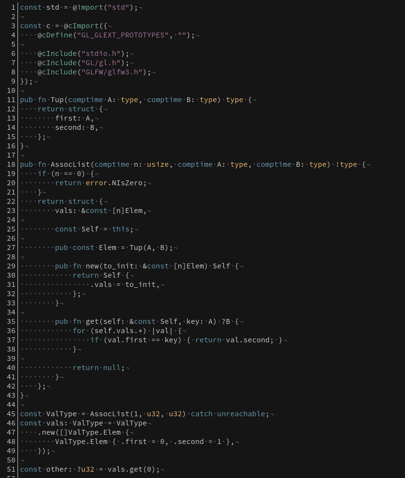

# zig.kak

Syntax highlighting for the [Zig language][zig] in the [Kakoune editor][kakoune], for those who like to pair their new-age hipster bullshit language with a new-age hipster bullshit text editor.

### Screenshot:

[zig]: https://ziglang.org/
[kakoune]: http://kakoune.org/
